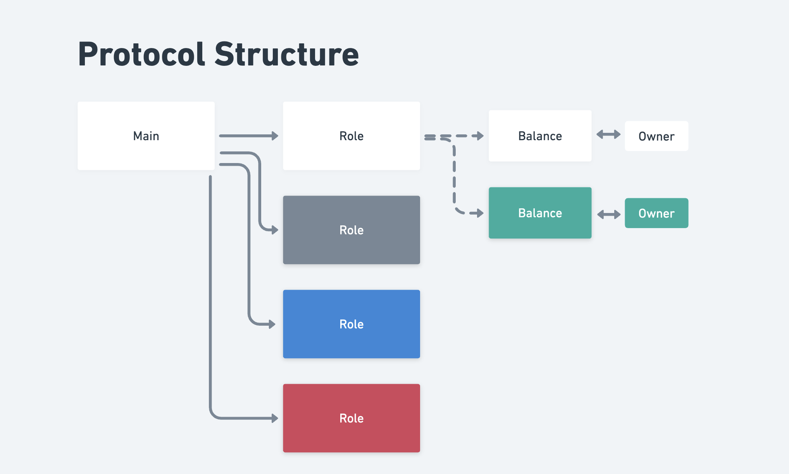
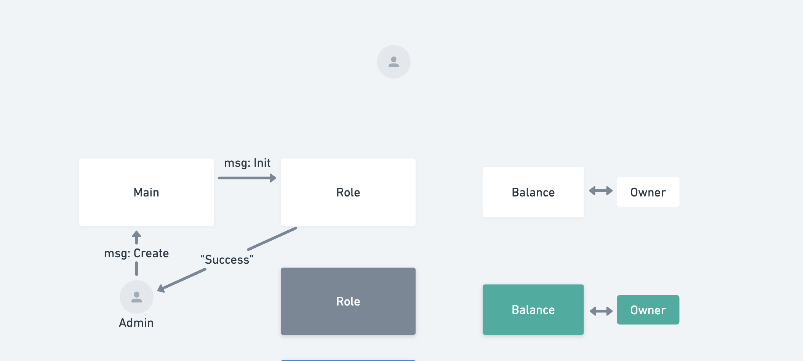
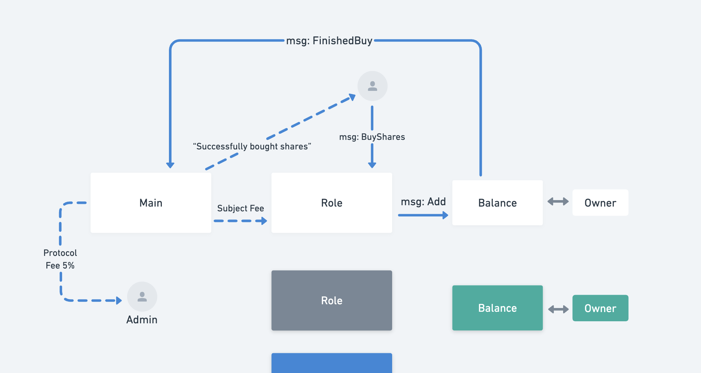

# Boilerplate for Implementing Friend Tech Protocol in Tact Language on TON Blockchain

This boilerplate serves as a template for implementing the Friend Tech protocol on the TON Blockchain using the Tact programming language. The pricing structure adheres to a predetermined equation. Please feel free to verify the code before using it; use it at your own risk.

## Key Components

-   There are three primary smart contracts involved:

    1. Main Contract
    2. Role Contract
    3. Balance Contract



## Administrative Permissions

-   Only an admin address has the authority to create a new Role contract. The admin can assign individuals as owners, also referred to as "Profiles for Celebrities."



## Buy Shares

Anyone can buy the shares for any Profile contract they like.


## Fee Structure

-   A transaction fee of 10% will be applied when people purchase shares. Of this fee, 5% will go towards the protocol, and the remaining 5% will be allocated to the owner of the Profile Contract.

# Commends

```bash
yarn build # To build contract
yarn test # To run test cases
yarn deploy # To deploy contract
yarn read # The way to read the smart contract data after your deployed the code
```

## More

For more information about this GitHub repository, or if you have any questions related to Tact, feel free to visit:

-   https://t.me/ton101
-   https://t.me/tactlang

If you have more specific questions related to the Tact Language, please refer to:

-   https://tact-lang.org/
